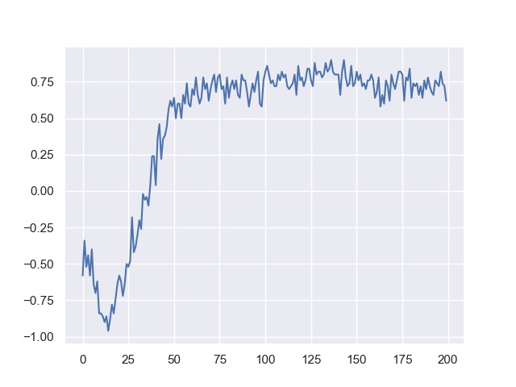
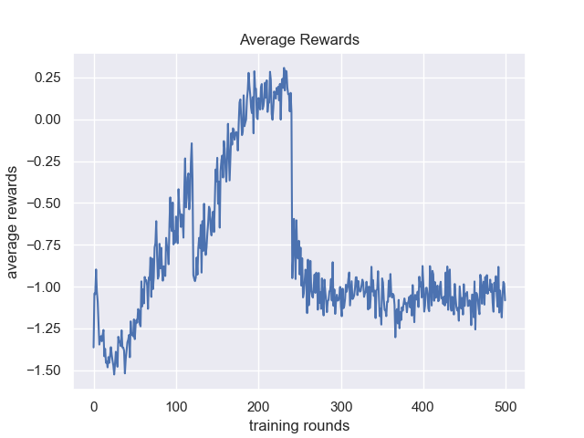
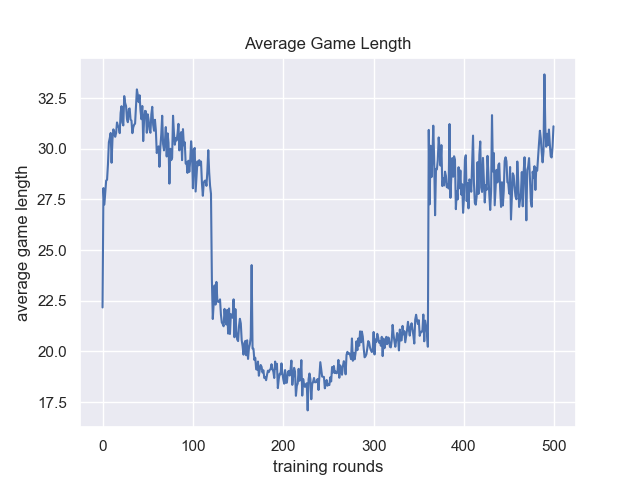

# Machikoro

## Implementation Details

This is an implementation of about 90% of the [base game](https://machi-koro.fandom.com/wiki/List_of_cards) (see TODOs).

Actions that an agent can take include:
* Do nothing
* Buy an establishment
* Buy a landmark

Rewards are +1 for a win, -1 for a loss. An extra penalty is added which grows with the number of turns that have 
elapsed (See Observations).

## Observations

Against opponents that takes purely random actions, agents learn how to win relatively easily. Shown below are the average
rewards over a sliding window of 100 games.

As the agent learns we can swap out the random players for agents using the same policy as the agent being trained.

In the images above, the opponents are updated every 120 steps (at 120, 240 etc). This goes well until the 240 update
where the agent starts struggling to make any improvement.

Playing against the agent from the 240th step is interesting. It tends to prioritise buying Stadiums, Bakeries and Cafes...
all good choices from a statistical POV. However, it tends to get into a winning position and then mass coins until another
player gets close to winning rather than just win. This will be an interesting behaviour to try and discourage.

**TODOs:**
* After the Train Station landmark is obtained, a player randomly rolls 1 or 2 dice rather than it being a choice.
* The Business Centre establishment does nothing
* The Radio Tower establishment does nothing
